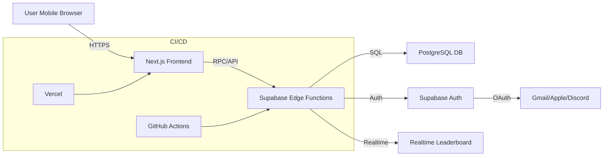

# Implementation Plan for Bracket Master Challenge

## 1. Overview

**Objective:**
- Build a mobile-first web application that allows spectators to predict the top-8 results of a video game tournament.
- Enforce secure authentication via Gmail, Apple, and Discord using Supabase Auth.

**Success Criteria:**
- Responsive UI/UX on mobile devices (portrait & standard landscape)
- Secure login & session management
- Real-time leaderboard updates
- Scalability to 10,000 concurrent users
- One submission per user, per tournament, before deadline

---

## 2. System Architecture

**Key Technologies:** Next.js 14, React, TypeScript, Tailwind CSS, Supabase (Auth & PostgreSQL), Vercel.

---

## 3. Module Breakdown

1. **Authentication & User Onboarding**
   - Social OAuth via Supabase for Gmail, Apple, Discord.
   - Enforce strong session cookies with `HttpOnly`, `Secure`, `SameSite=Strict`.
   - Display privacy policy & TOS on sign-up.

2. **Landing & Marketing Pages**
   - Dark theme & glassmorphism UI components.
   - Mobile-responsive design, using Tailwind’s utility classes.
   - CTA for “Start Your Prediction” gated by authentication state.

3. **Prediction Interface**
   - Two-column drag-and-drop (or tap-to-select) layout.
   - Client-side slot validation & visual feedback.
   - Disable “Submit” until all 8 slots filled.

4. **Submission & Confirmation**
   - Submit via POST to Supabase Edge Function.
   - Server-side validation (user hasn’t submitted; before cutoff).
   - Store timestamp & prediction array in PostgreSQL.
   - Return success response & redirect to confirmation screen.

5. **Leaderboard & Scoring**
   - Admin UI (protected route) to enter final results.
   - Edge Function computes scores using defined point weights.
   - Realtime leaderboard via Supabase Realtime or subscription.

6. **Admin Interface**
   - Role-based access (RBAC): Only `admin` role can update results.
   - Manual participant list edits via database seed script or migration.

7. **Infrastructure & Deployment**
   - Vercel for frontend and Edge Functions.
   - Enforce HTTPS & HSTS headers.
   - Use environment variables & secrets via Vercel Secret Management.

---

## 4. Security Considerations

### 4.1 Authentication & Session Management
- Use Supabase’s JWTs with `HS256` or `RS256`, validate `exp` and `aud` claims.
- Protect against session fixation by regenerating tokens on login.
- Enforce idle (15m) and absolute (24h) session timeouts.
- Implement logout endpoint to revoke refresh tokens.

### 4.2 Input Handling & Data Validation
- All API endpoints use parameterized queries (Supabase client or pg-prepared statements).
- Server-side validation via Zod for JSON payloads (predictions, admin inputs).
- Limit array length to exactly 8 and enforce unique player IDs.
- Validate redirect URLs against allow-list.

### 4.3 API & Rate Limiting
- Enforce HTTPS for all calls.
- Throttle prediction submissions: 1 per user per tournament.
- Protect admin routes with RBAC & JWT verification.
- Use CORS policy allowing only `https://fullcombo.gg`.

### 4.4 Data Protection & Secrets Management
- Store secrets (Supabase anon/key, OAuth client secrets) in Vercel environment variables.
- Rotate keys quarterly.
- Encrypt database at rest via Supabase-managed encryption.
- Mask PII in logs; avoid logging email addresses or tokens.

### 4.5 Web Security Hygiene
- Add security headers in Next.js custom server or `next.config.js`:
  - `Content-Security-Policy`
  - `X-Frame-Options: DENY`
  - `X-Content-Type-Options: nosniff`
  - `Referrer-Policy: strict-origin-when-cross-origin`
- Use anti-CSRF tokens for state-changing requests (if using cookies).
- Validate file uploads for admin (if any) with type & size checks.

---

## 5. Data Model (PostgreSQL)

| Table                   | Columns                                    | Notes                               |
|-------------------------|--------------------------------------------|-------------------------------------|
| users                   | id (PK), email, created_at, role           | Managed by Supabase Auth           |
| tournaments             | id (PK), name, start_time, end_time        | Single row for MVP                  |
| players                 | id (PK), name, avatar_url                  | Seeded manually                     |
| predictions             | id (PK), user_id (FK), tournament_id (FK),  slots JSONB, submitted_at | Unique constraint on (user_id, tournament_id) |
| results                 | tournament_id (PK), slots JSONB            | Admin inputs                       |
| scores                  | id (PK), user_id (FK), tournament_id (FK), score | Computed after results submission   |

---

## 6. API Endpoints

### Public
- `GET /api/tournament` – fetch tournament metadata & player list

### Authenticated
- `POST /api/prediction` – submit prediction (validate deadline & uniqueness)
- `GET  /api/prediction` – fetch user’s prediction

### Admin (RBAC)
- `POST /api/results` – submit final results & trigger score calculation
- `GET  /api/leaderboard` – fetch sorted user scores

---

## 7. UI/UX & Component Library

- **Design System:** Tailwind CSS + Shadcn UI (glassmorphism tokens)
- **Font:** Inter, fallback sans-serif
- **Theme:** Dark base with #55ca0e accents
- **Components:**
  - SocialLoginButton (with provider icon & aria-label)
  - PredictionSlot & PlayerCard (draggable)
  - Modal & Toast for errors/confirmations
  - LeaderboardTable (sortable, virtualized for performance)

---

## 8. Performance & Scalability

- **Code Splitting:** Dynamic imports for heavy components (drag-and-drop lib)
- **Cache:** ISR (Incremental Static Regeneration) for public pages
- **Connection Pooling:** Supabase client reuse via singleton pattern
- **Realtime:** Use Supabase Realtime channels for leaderboard updates
- **Load Testing:** Target 10k concurrent via k6 or Artillery

---

## 9. CI/CD & Quality Assurance

- **Pipeline:** GitHub Actions → Run lint, type-check, unit & integration tests → Deploy to Vercel Preview
- **Testing:**
  - Unit tests (Jest + React Testing Library)
  - Edge Function tests (Vitest)
  - E2E tests (Playwright) on mobile viewport
- **Security Scans:** Snyk or Dependabot for dependency vulnerabilities
- **Code Coverage:** Enforce 80%+ coverage gate

---

## 10. Project Roadmap & Timeline

| Phase                       | Duration | Deliverables                                |
|-----------------------------|----------|---------------------------------------------|
| Planning & Design           | 1 week   | Architecture diagram, data model, UI mockups |
| Core Auth & Onboarding      | 1 week   | Social login, session management, landing page |
| Prediction Interface        | 2 weeks  | Drag-drop UI, API integration, validation   |
| Submission & Confirmation   | 1 week   | Submit endpoint, confirmation screens       |
| Leaderboard & Admin         | 2 weeks  | Admin UI, result ingestion, score calc, realtime leaderboard |
| Security & Hardening        | 1 week   | Security headers, rate limiting, audits     |
| Testing & Performance Tuning| 1 week   | E2E tests, load tests, bug fixes           |
| Final Review & Launch       | 1 week   | Production deployment, monitoring setup     |

Total: ~10 weeks

---

## 11. Risks & Mitigations

- **OAuth Flow Failures:** Test each provider end-to-end; fallback to email-based login.
- **Deadline Enforcement Bugs:** Thorough unit tests on date/time logic; use server timestamp.
- **High Traffic Spikes:** Enable horizontal scaling on Edge Functions & database connection pooling.
- **Security Vulnerabilities:** Automated SCA scans + manual pentest on MVP.

---

**Next Steps:**
1. Finalize UI mockups & design tokens.
2. Provision Supabase project & configure OAuth credentials.
3. Kick off GitHub repo with CI/CD skeleton.
4. Schedule sprint planning session.

> _Bracket Master Challenge_ – secure, performant, and ready for real-time tournament action!